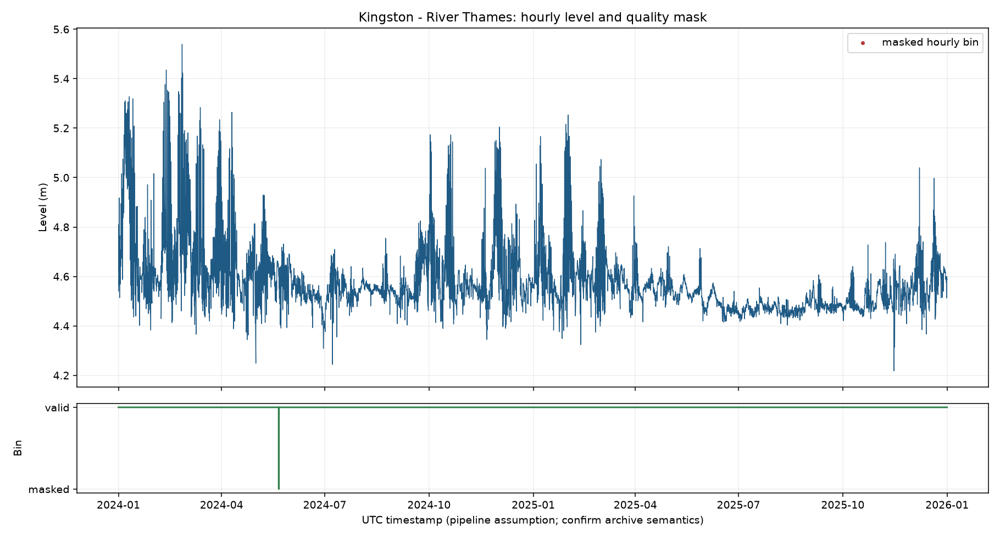
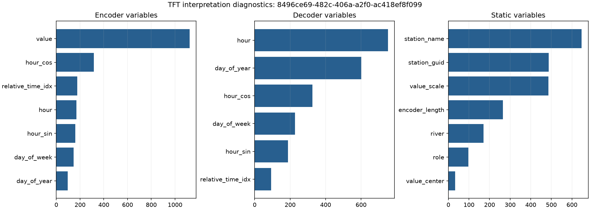

# From Leaks to Levels

Temporal Fusion Transformer (TFT) reimplementation and transfer study for UK
river-level forecasting.



*Kingston (River Thames): hourly level for the two-year window, with masked
bins marked below the series. One of these figures exists per station in
`reports/figures/`.*

## Status

This repository contains a runnable Phase 0-6 research pipeline. The
Environment Agency hydrology API probe and evidence report are included at
`probe_ea_hydrology.py` and `EA_HYDROLOGY_FIT_REPORT.md`. The Electricity
harness has a measured eight-series, five-epoch CPU TFT run, but it does not
claim exact paper parity. The frozen nine-station EA extract, hourly pipeline,
bounded river baseline ladder, nine-station one-epoch river TFT smoke run,
interpretability figure, and retrospective residual review are recorded in
`data/frozen/`, `data/hourly/`, `reports/figures/`, `RESULTS.md`, and
`ANOMALIES.md`. The smoke run skips Hereford Bridge because its selected
outage leaves no validation context; this is reported explicitly.

## Quick start

From the repository root:

```text
conda env create -f environment.yml
conda activate river-levels-tft
python -m src.probe --help
python -m src.benchmark_electricity --smoke
python -m src.river_experiment --max-windows 16 --results-json results/river_baselines.json
python -m src.river_review --model seasonal_naive --max-windows 16
python -m src.live_collect --station 8496ce69-482c-406a-a2f0-ac418ef8f099 --latest
```

The probe makes serial live requests to the Environment Agency archive and
prints a quality summary. It writes no data files. Run it only when a live
recheck is intended; the archive is mutable and may revise historical rows.

The benchmark smoke command checks the metric and rolling-window plumbing on a
deterministic synthetic series. It is explicitly not an Electricity result.
After creating the environment, use
`python -m src.benchmark_electricity --skip-tft` to download and inspect the
real benchmark data before attempting the CPU/MPS TFT run. The measured
configuration used for the checked-in benchmark evidence is:

```text
python -m src.benchmark_electricity --accelerator cpu --max-series 8 \
  --max-epochs 5 --batch-size 128 --skip-optional-baselines \
  --results-json data/benchmark/electricity/phase1_tft_8series_epoch5_cpu_fixed.json
```

The full river TFT path is deliberately opt-in because it trains one model per
station. A small real-station smoke run is:

```text
python -m src.river_experiment \
  --station 8496ce69-482c-406a-a2f0-ac418ef8f099 \
  --run-tft --tft-accelerator cpu --tft-max-epochs 1 --tft-batch-size 128 \
  --max-windows 2 --results-json results/river_one_station_tft.json
```

## Study decisions

- Hydrology archive API: bulk history and frozen training extracts.
- Flood-monitoring API: live incremental collection; it is not a substitute
  for the archive history.
- Target: each station's qualified 15-minute water-level measure, aggregated
  to hourly for the TFT input while retaining raw 15-minute data for checks.
- Initial verified window: `2024-01-01 <= t < 2026-01-01`.
- Core stations: Kingston, Thorverton, Bewdley, Colwick, Skelton, and Bywell.
- Stress-test stations: Caton, Hereford Bridge, and Roxton.
- Quality flags, revised rows, missing values, duplicate/off-grid timestamps,
  time-zone semantics, and station datum/scale are first-class data concerns.
- This is a research decision-support study, not a flood-warning service and
  must not be used for safety-critical decisions.

The station IDs and quality rules are in `configs/`. The hydrology and
flood-monitoring identifier crosswalk in `configs/stations.yml` was populated
from explicit live API `sameAs`, station-reference, WISKI, and RLOI metadata;
IDs must never be guessed from their appearance.

## Artefacts and status

- `BENCHMARKS.md`: Electricity source, preprocessing, documented delta table,
  paper references, and measured-run recording contract.
- `DATA_QUALITY.md` and `data/frozen/manifest.json`: frozen EA provenance,
  checksums, quality rules, and the verified nine-station window.
- `notebooks/01_series_overview.ipynb` and `reports/figures/`: one generated
  series/quality-mask figure per station.
- `RESULTS.md` and `results/river_baselines.json`: bounded rolling-origin
  river baseline ladder plus measured one- and nine-station TFT smoke results.
- `ANOMALIES.md` and `src/river_review.py`: validation-calibrated residual
  review definitions and diagnostic counts.
- `reports/figures/tft_interpretability.png` and `src/interpretability.py`:
  variable-selection diagnostics from the measured Kingston TFT run.
- `TECHNICAL_NOTE.md`: concise method, evidence, and limitation note.



*Variable-selection diagnostics from the measured Kingston TFT run.*

Raw JSONL/CSV data and run caches are ignored by the source-control rules to
avoid accidental redistribution. Regenerate them with `python -m src.freeze`
and record the resulting manifest/checksums with any shared dataset copy.

## Data acknowledgement

Environment Agency data
must retain the following acknowledgement in the README and every published
output:

> Contains public sector information licensed under the Open Government Licence v3.0.

The live collector must also retain the flood-monitoring API attribution
specified by that service:

> this uses Environment Agency flood and river level data from the real-time data API (Beta)

`src.live_collect` uses the explicit station crosswalk, supports `latest` and
station `since` catch-up requests, filters full measure metadata to level
readings, and preserves the raw live objects. It is an incremental collector,
not a substitute for the hydrology archive and not a warning service. See
`EA_HYDROLOGY_FIT_REPORT.md` for the live API evidence, limits, and caveats.
